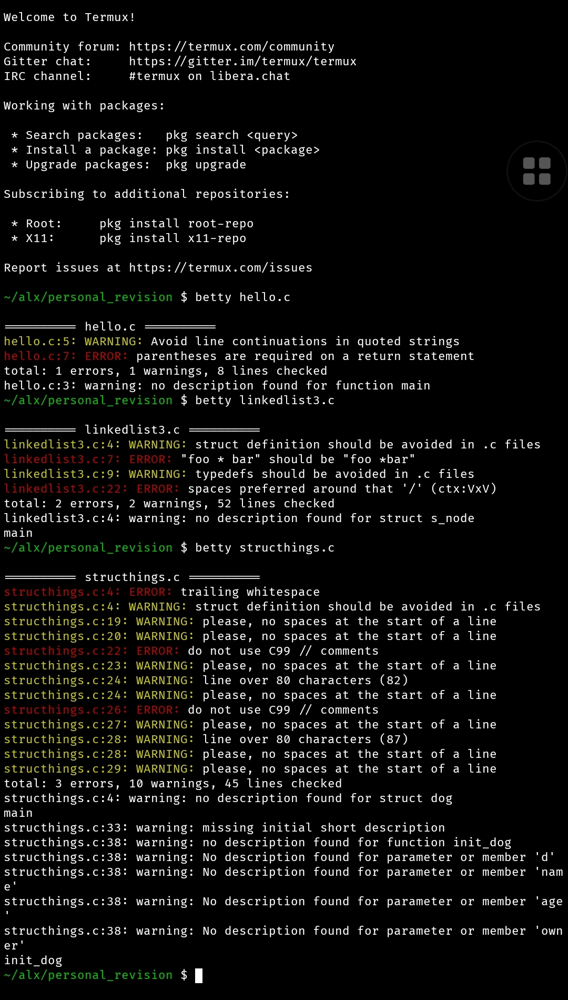

# Betty Wrapper

### Installation

Simply clone the Betty repo using the link provided in the 0x00. C - Hello, World project or click here [Betty](https://github.com/alx-tools/Betty).

Secondly, clone this repo and copy the files `phone-install.sh` and `phone-betty.sh` into the Betty repo

Next, run: `./phone-install.sh`while you are inside the Betty repo. This will install the betty linter on your phone (running the termux mobile app).

Lastly, restart your terminal or start a new session.

Note: If you encounter the `env: 'perl'` error. Simply `pkg install perl`.

### Usage

Refer to the project page on the intranet for usage instructions.

# Changelog
This file contains the notable changes made to the Betty_Wrapper repo.

## New
	- Added sample screenshot of what to expect after a successful installation of the betty linter
	- Added installation setup files

## Changes 
	-

## Fixes
	- Fixed issues of copying the phone-betty.sh code to just running the installation file
	- Fixed other installation related errors
    - Added execute permission for all user to the files.

##### This wrapper aims to solve the challenges faced by some Alx students who wishes to code on their phones. Betty Linter can now be installed on mobile devices running the termux app.

###### We Rise by Lifting Others.
